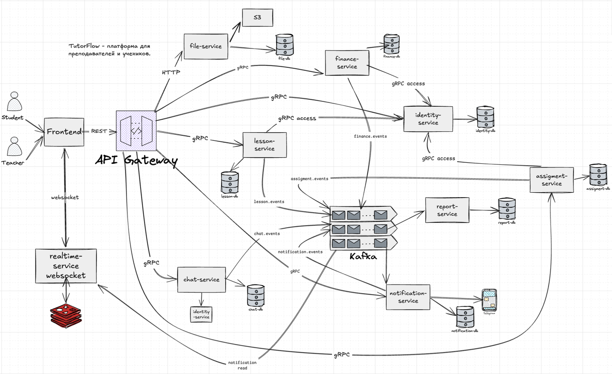

# TutorFlow

TutorFlow — учебная LMS-платформа для работы частного преподавателя с учениками.
В одном приложении собраны расписание, занятия, домашние задания, файлы,
финансовый учёт с ручной проверкой чеков, дашборды, уведомления, личный чат и
realtime push.

Проект написан как **microservices монорепозиторий**: 
публичный API gateway и девять специализированных C++20/userver сервисов.
Восемь из них доступны только внутри сети, а `realtime-service` публикует
отдельный WebSocket endpoint. У сервисов свои границы данных, синхронные
gRPC-контракты и асинхронные Kafka events.

**Production demo:** [https://netwatch-arsen-demo.ru](https://netwatch-arsen-demo.ru)

### Что может пользователь

**Преподаватель:**

- регистрируется и добавляет учеников;
- задаёт почасовую ставку и доступные интервалы;
- создаёт, переносит, завершает, отменяет и восстанавливает занятия;
- выдаёт ДЗ, прикладывает файлы, проверяет решения и пишет комментарии;
- видит баланс, журнал операций и чеки учеников;
- вручную подтверждает или отклоняет чек;
- использует дашборд, уведомления и личный чат.

**Ученик:**

- входит в созданную преподавателем учётную запись;
- видит расписание и материалы занятий;
- читает ДЗ, сдаёт текст и файлы, получает результат проверки;
- загружает чек и отслеживает его статус;
- видит баланс, операции, дашборд, уведомления и чат.

### Масштаб реализации

```text
1 публичный REST gateway
9 backend-сервисов: 8 внутренних + публичный realtime push
9 логических PostgreSQL БД, включая 2 shard чата
5 Kafka domain topics
Redis + MinIO/S3 + Prometheus/Grafana
Docker Compose production deploy + локальный Kubernetes/kind deploy
```

Всего запускается десять C++ процессов: gateway и девять сервисов
`identity`, `lesson`, `assignment`, `finance`, `file`, `notification`,
`report`, `chat`, `realtime`.

### Короткий путь данных

```text
Browser
  ├── REST/JSON ─────► api-gateway ──gRPC──► domain services
  │                         └──HTTP multipart──► file-service
  └── WebSocket ─────► realtime-service

Domain transaction ─► PostgreSQL + outbox ─► Kafka
Kafka ─► finance / notification / report / realtime
realtime ─► Redis pub/sub ─► WebSocket connection
```

## Архитектура

<p align="center">
  
</p>

Снаружи доступны только:

- `api-gateway` для доменных REST-команд и чтений;
- `realtime-service` для WebSocket push;
- frontend и маршрутизирующий reverse proxy в production.

HTTP-порты внутренних сервисов нужны для health/readiness/metrics и file
multipart внутри сети

## Как выбирается транспорт

| Транспорт | Где | Почему |
|---|---|---|
| REST/JSON | frontend → gateway | понятный публичный API для браузера |
| HTTP multipart | gateway → file-service | естественная передача файлов без protobuf wrapping |
| gRPC | gateway → services; services → identity | ответ или access-check нужен прямо сейчас |
| Kafka | доменные факты и side effects | producer не знает всех будущих consumers |
| WebSocket | frontend ↔ realtime | server push без polling |
| Redis pub/sub | между realtime replicas | доставить event в процесс с нужным connection |

## Сервисы

| Сервис | Ответственность | Состояние | Подробности |
|---|---|---|---|
| `api-gateway` | публичный REST, JWT boundary, CORS, routing и mapping | stateless | [README](services/api-gateway/README.md) |
| `identity-service` | users, roles, profiles, JWT, teacher-student access | `identity_db` | [README](services/identity-service/README.md) |
| `lesson-service` | availability, lessons и lifecycle | `lesson_db` | [README](services/lesson-service/README.md) |
| `assignment-service` | assignments, submissions, reviews, comments, deadlines | `assignment_db` | [README](services/assignment-service/README.md) |
| `finance-service` | ledger, receipts, payments, balance, corrections | `finance_db` | [README](services/finance-service/README.md) |
| `file-service` | file metadata и local/S3 storage | `file_db` + MinIO/volume | [README](services/file-service/README.md) |
| `notification-service` | persistent in-app notifications из events | `notification_db` | [README](services/notification-service/README.md) |
| `report-service` | dashboard read-models | `report_db` | [README](services/report-service/README.md) |
| `chat-service` | dialogs, messages, attachments, read markers | `chat_db_shard0/1` | [README](services/chat-service/README.md) |
| `realtime-service` | WebSocket connections, presence и push fan-out | Redis + process memory | [README](services/realtime-service/README.md) |

### api-gateway

Gateway валидирует JWT, удаляет недоверенные `X-User-*`, формирует trusted user
context и вызывает typed clients. Он не владеет базой и не содержит бизнес-
правил. Файлы — единственное исключение из внутреннего gRPC: multipart body
проксируется в file-service по HTTP.

### identity-service

Identity объединяет auth и profiles, хранит парольные hash и выпускает JWT.
Он является каноническим владельцем связи teacher-student и предоставляет
`CheckTeacherStudentAccess`, который используют остальные сервисы вместо
чтения чужой БД.

### lesson-service

Lesson хранит расписание и snapshot цены. PostgreSQL exclusion constraint
атомарно запрещает пересекающиеся `scheduled` занятия teacher. Изменения
lifecycle публикуются через outbox; charge напрямую не создаётся.

### assignment-service

Assignment хранит условие, историю submissions, review и контекстные comments.
Deadline worker переводит только `assigned/needs_fix` с прошедшим due date в
`expired` и пишет event в той же транзакции.

### finance-service

Finance владеет append-only ledger. Он создаёт charge из `lesson.completed`,
меняет баланс после подтверждения receipt и выражает отмену/восстановление
completed lesson компенсирующими corrections.

### file-service

File-service отделяет metadata от bytes. `IFileStorage` переключает local и
S3/MinIO backend. S3 transport реализован `userver::s3api`, а небольшой
TutorFlow authenticator добавляет AWS SigV4. Bucket создаётся инфраструктурным
init-процессом; другие домены хранят только `file_id`.

### notification-service

Notification превращает поддерживаемые events в persistent сообщения user,
защищает consumer inbox и публикует `notification.created`. Поэтому offline
пользователь не теряет уведомление.

### report-service

Report строит entity-state tables и агрегаты dashboard. Он использует upsert и
recompute вместо хрупких счётчиков `+1/-1`; при расхождении источником истины
остаётся доменный сервис.

### chat-service

Chat хранит личные диалоги и сообщения. Детерминированный UUIDv5 одной пары
даёт идемпотентный find-or-create и заранее определяет shard. Запрос списка
делает scatter-gather по двум БД.

### realtime-service

Realtime потребляет `message.*` и `notification.created`, использует Redis для
межрепличного fan-out и отправляет события в локальные WebSocket connections.
После reconnect клиент синхронизируется через REST.

## Сквозные потоки

### 1. Вход и trusted user context

```text
POST /auth/login
  → gateway → identity gRPC Login
  → password PBKDF2 verification
  → JWT(sub, roles, iat, exp)

Следующий запрос с Bearer token
  → gateway локально проверяет JWT
  → удаляет входящие X-User-*
  → передаёт typed UserContext в gRPC
  → domain service проверяет роль/ownership/access
```

Gateway подтверждает identity caller, а конечный сервис проверяет доменную
авторизацию.

### 2. Завершение занятия → начисление → dashboard → notification

```text
POST /lessons/{id}/complete
  → gateway
  → LessonService.CompleteLesson
  → lesson_db:
       lessons.status = completed
       outbox += lesson.completed
     [одна транзакция]
  → Kafka tutorflow.lesson.events
  ├── finance consumer:
  │     charge + balance.changed + inbox/outbox
  ├── report consumer:
  │     report_lessons + dashboard aggregates
  └── notification consumer:
        notification + notification.created
          → realtime → Redis → WebSocket
```

HTTP-ответ не ждёт charge и возвращает `charge_status=pending`. Unique
`lesson_id` для charge гарантирует, что replay не создаст второе начисление.

### 3. Чек и ручная оплата

```text
Student POST /files (receipt bytes)
  → file-service → file_id

Student POST /payments/receipts
  → finance receipt(status=pending_review)
  → payment_receipt.uploaded
  → teacher notification

Teacher POST /payments/receipts/{id}/confirm
  → receipt=confirmed + payment transaction
  → payment.confirmed + balance.changed
  → student notification + report update
```

При upload баланс не меняется. Reject не создаёт payment. Повторный confirm не
создаёт вторую операцию благодаря unique `receipt_id` и проверке status.

### 4. Домашнее задание

```text
Teacher creates assignment
  → assignment + files + assignment.created
  → student notification/report

Student submits text/file_ids
  → новая submission + submission.uploaded
  → teacher notification/report

Teacher reviews latest submission
  → status reviewed/needs_fix/accepted
  → assignment.reviewed
  → student notification/report
```

Повторная сдача создаёт новую submission и сохраняет историю; старое решение не
перезаписывается.

### 5. Файл

```text
multipart → gateway auth → file-service
  → storage.Put(storage_key, bytes)
  → file_db.files metadata
  ← file_id

download → owner/teacher-student access check
  → metadata → storage.Get(storage_key)
```

Если запись metadata падает после upload bytes, сервис пытается удалить object.
В S3-режиме Compose/Kubernetes сначала идемпотентно создаёт bucket через
`minio-init`, а затем запускает file-service.

### 6. Сообщение и realtime push

```text
POST /chats/{dialog}/messages
  → gateway → chat gRPC
  → shard(dialog_id): message + attachments + outbox
  → message.sent
  ├── notification-service → persistent notification
  └── realtime-service
        → unread cache + Redis user channel
        → WebSocket recipient
```

Если recipient offline, WebSocket event не хранится, но message и notification
остаются в своих БД. После reconnect frontend перечитывает состояние.

## Данные и границы владения

В dev/prod используется один PostgreSQL instance, но разные логические базы:

```text
identity_db
lesson_db
assignment_db
finance_db
file_db
notification_db
report_db
chat_db_shard0
chat_db_shard1
```

- сервис подключается только к своей БД;
- foreign key существует только внутри одной service DB;
- `user_id`, `lesson_id`, `file_id` между сервисами — stable identifiers;
- чужие данные читаются через API/event, а не через SQL JOIN;
- миграции находятся в `migrations/<service>/`;
- one-shot `migrator` применяет схемы при Compose/Kubernetes startup.

## Kafka и событийная модель

### Topics

Используется пять доменных topics:

```text
tutorflow.lesson.events
tutorflow.assignment.events
tutorflow.finance.events
tutorflow.chat.events
tutorflow.notification.events
```

Конкретный факт находится в `event_type` общего envelope. Kafka key выбирается
по aggregate (`lesson_id`, `assignment_id`, `receipt_id`, `dialog_id`,
`user_id`), чтобы события одной сущности шли в одну partition.

### Event envelope

```json
{
  "event_id": "uuid",
  "event_type": "lesson.completed",
  "event_version": 1,
  "occurred_at": "2026-07-11T12:00:00Z",
  "producer": "lesson-service",
  "payload": {}
}
```

### Transactional outbox

1. domain data и `outbox_events(pending)` записываются одной DB transaction;
2. periodic publisher читает pending rows;
3. Kafka producer отправляет envelope;
4. row помечается `published`;
5. при ошибке row остаётся pending и будет повторена.

Гарантия получается **at least once**, а не exactly once: producer может
отправить event, упасть до отметки `published` и отправить повторно.

### Consumer inbox и идемпотентность

Каждый consumer обязан безопасно принять дубль:

- finance charge: inbox + unique charge по `lesson_id`;
- finance payment: unique payment по `receipt_id`;
- lifecycle correction: `processed_events`, correction и outbox одним SQL;
- notification: inbox + `UNIQUE(user_id, source_event_id)`;
- report: inbox + entity upsert + aggregate recompute;
- deadline worker: status transition делает строку непригодной для повторного
  expire.

Kafka не заменяет DB constraints: обе защиты дополняют друг друга.

### Outbox при нескольких репликах

Если запустить несколько экземпляров domain service, у каждого будет свой
periodic publisher. Shared outbox helper берёт
`pg_try_advisory_xact_lock`; batch читает и публикует только одна реплика.

## Финансовая модель

```text
balance = charge - payment + correction - refund
```

Пример lifecycle одного занятия:

```text
complete          +3000 charge       balance +3000
cancel completed  -3000 correction   net 0
restore completed +3000 correction   net +3000
```

Исходный charge не удаляется. Аудитор видит всю историю причин изменения.

`balance.changed` переносит абсолютное значение после операции. Report-service
не пересчитывает деньги из набора событий и не становится вторым ledger.

## Шардирование чата

### Placement

Dialog ID детерминирован:

```text
UUIDv5(namespace, lower(teacher_id) + ":" + lower(student_id))
```

Shard выбирается вручную:

```text
FNV-1a(dialog_id bytes) % 2
```

В одном shard лежат dialog, messages, attachments, read markers и outbox.
Горячие операции одного dialog не требуют распределённой transaction.

### Scatter-gather

`ListDialogsForUser` выполняется на обоих shard, результаты объединяются,
дедуплицируются и сортируются по `last_message_at`. Это приемлемо при двух shard
и небольшом списке диалогов, но не масштабируется линейно до сотен shard.

## Масштабирование Kafka

Обычный dev/prod Compose использует один KRaft broker для экономии ресурсов.
Локальный overlay
[`deploy/compose/local.kafka-cluster.yml`](deploy/compose/local.kafka-cluster.yml)
поднимает три broker:

- 5 topics × 3 partitions;
- replication factor 3;
- `min.insync.replicas=2`;
- idempotent producer;
- `acks=all`;
- consumer groups для распределения partitions.

Переключение между single- и multi-broker режимом требует удаления **локальных**
volumes: KRaft metadata разных controller quorum несовместимы.

## Health, readiness и self-healing

- `/health` отвечает, если процесс и listener живы;
- `/ready` проверяет только собственные критичные зависимости;
- DB-backed service проверяет свою PostgreSQL DB;
- realtime проверяет Redis;
- file-service в S3-режиме проверяет DB и уже созданный инфраструктурой bucket;
- Kafka и чужие сервисы не входят в readiness: clients/consumers ретраят сами.

Это разделение важно для Kubernetes: потеря DB выводит pod из балансировки, но
liveness не заставляет бесконечно рестартить исправный процесс.

Monitor listener каждого C++ сервиса находится на `HTTP port + 10000`, например
gateway metrics — `18080`. Эти порты остаются внутри сети.

## Observability

Опциональный профиль добавляет:

- Prometheus;
- kafka-exporter;
- provisioned Grafana dashboard `TutorFlow Overview`.

```bash
docker compose --profile observability up -d
open http://localhost:${GRAFANA_PORT:-3000}/d/tutorflow-overview/tutorflow-overview
```

Dashboard показывает:

- request rate по сервисам;
- HTTP handler p95 latency;
- 4xx/5xx rate;
- активные/свободные PostgreSQL connections;
- Kafka consumer-group lag;
- длительность outbox tick;
- outbox publish rate.

Профиль локальный и не меняет default/production stack. Остановка без удаления
данных:

```bash
docker compose --profile observability down
docker compose up -d
```

## Kubernetes

[`deploy/k8s/`](deploy/k8s/) — второй рабочий локальный путь развёртывания:

- kind cluster;
- kustomize base + local overlay;
- Deployments/Services для приложений;
- StatefulSets/PVC для инфраструктуры;
- migrator и kafka-init Jobs;
- ingress-nginx;
- liveness/readiness probes;
- HPA notification-service;
- metrics-server.

Production demo остаётся на Docker Compose + Caddy. Kind нужен для проверки
оркестрации без перегрузки небольшого production VM.

```bash
./deploy/k8s/kind-up.sh
kubectl get pods,svc,ingress,hpa -n tutorflow
GATEWAY_URL=http://localhost python3 scripts/smoke_mvp.py
```

## Структура репозитория

```text
services/
  api-gateway/            public REST facade
  identity-service/       auth, users, access
  lesson-service/         schedule and lifecycle
  assignment-service/     homework workflow
  finance-service/        ledger and receipts
  file-service/           metadata + object storage
  notification-service/   in-app projection
  report-service/         dashboard read models
  chat-service/           sharded dialogs/messages
  realtime-service/       WebSocket push

libs/
  common/                 errors, auth context, JWT, HTTP helpers
  proto/                  protobuf contracts + generated gRPC targets
  clients/                reusable internal gRPC clients
  events/                 envelope, producer/consumer, outbox helpers/metrics

migrations/               SQL grouped by owner service
frontend/                 React/Vite SPA
tests/                    gateway-facing pytest integration suite
scripts/                  migrations and end-to-end smoke
deploy/                   Caddy, observability and Kubernetes
docs/                     contracts, events, ADR, runbooks and roadmaps
```

## Типовая структура C++ сервиса

```text
main.cpp
  → registers userver components

grpc/*_grpc_service.cpp или handlers/*.cpp
  → transport parsing/mapping

domain/*_service.cpp
  → roles, validation, domain rules

repositories/*_repository.cpp
  → SQL и атомарные state transitions

outbox/ | consumers/ | workers/
  → asynchronous side effects
```

Не каждый сервис имеет все папки. File использует `storages/`, realtime —
`ws/`, `kafka/`, `redis/`, gateway — `clients/` и HTTP handlers.

## Общие библиотеки

| Библиотека | Содержание |
|---|---|
| `tutorflow_common` | error envelope, auth context, JWT, shared HTTP helpers |
| `tutorflow_proto` | protobuf definitions и userver gRPC codegen |
| `tutorflow_grpc_clients` | переиспользуемый identity client и client base |
| `tutorflow_events` | envelope, Kafka adapters, outbox publisher и statistics |

`libs/common` не содержит domain DTO и не даёт сервисам универсальную обёртку
для доступа к чужим данным.

## CI/CD

CI разделён на три независимых workflow. Обычный `git push` ничего не запускает,
поэтому отправка промежуточных изменений не приводит к долгой сборке всего
микросервисного стека.

### Быстрые проверки Pull Request

`.github/workflows/ci.yml` автоматически запускается только для Pull Request и
выполняет короткие структурные проверки:

- `actionlint` — синтаксис и GitHub Actions expressions во всех workflow;
- `npm ci` + frontend build;
- `pytest --collect-only` — проверку импорта и обнаружения Python-тестов без
  обращения к запущенным сервисам;
- проверку всех Compose-вариантов из `deploy/compose/`.

При отправке нового коммита в тот же Pull Request незавершённый предыдущий
быстрый прогон отменяется.

Ту же структурную проверку production Compose можно выполнить локально без
запуска контейнеров:

```bash
docker compose --project-directory . --env-file deploy/.env.prod.example \
  -f deploy/compose/production.yml config >/dev/null
```

### Полные тесты — ручной запуск

`.github/workflows/tests.yml` (`Manual Tests`) запускается вручную:

Workflow проверяет, что checkout совпадает с `head_sha` запуска, а затем
последовательно выполняет:

1. C++ unit-тесты `tutorflow-events-unit-tests` и
   `chat-sharding-unit-tests` внутри закреплённого userver-образа;
2. сборку и запуск полного Docker Compose-стека;
3. ожидание `GET http://localhost:8080/health`;
4. все gateway-facing интеграционные тесты: `python -m pytest -q tests`;
5. сквозной MVP smoke: `python scripts/smoke_mvp.py`;
6. остановку контейнеров и удаление созданных CI volumes.

При ошибке workflow прикладывает artifact `compose-diagnostics-*` со статусом и
логами контейнеров. Максимальная длительность прогона ограничена двумя часами.

### Deploy — ручной и только после тестов

`.github/workflows/deploy.yml` (`Deploy`) также запускается только через
**workflow_dispatch**. Единственный обязательный input — полный 40-символьный
`commit_sha`.

Перед сборкой deploy workflow:

1. проверяет формат SHA и делает checkout именно этого коммита;
2. через GitHub Actions API ищет успешный запуск `Manual Tests`;
3. требует точного совпадения `head_sha` тестового запуска и `commit_sha`;
4. блокирует деплой, если такого успешного запуска нет.

После успешной проверки:

```text
Manual Tests для commit SHA (success)
  → Deploy с тем же полным commit SHA
  → проверка test gate
  → build 11 images (frontend + 10 C++ processes)
  → push images с тегом commit SHA в GHCR
  → upload compose/deploy/migrations именно из этого commit SHA
  → SSH: docker compose pull/up
  → публичная проверка https://<domain>/health
```

Свободный `image_tag` и публикация `latest` не используются: протестированный
исходный код, Docker-образы, Compose-файл и миграции всегда относятся к одному
коммиту. Production использует Docker Compose + Caddy. Для rollback нужно
повторно запустить deploy с SHA ранее протестированного коммита; данные
PostgreSQL/MinIO требуют отдельной backup/restore стратегии.
