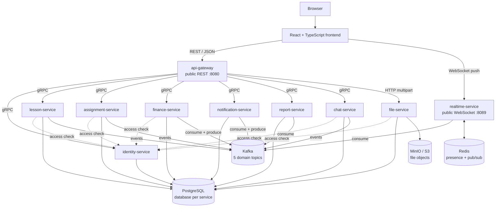

# TutorFlow

TutorFlow — учебная LMS-платформа для работы частного преподавателя с учениками.
В одном приложении собраны расписание, занятия, домашние задания, файлы,
финансовый учёт с ручной проверкой чеков, дашборды, уведомления, личный чат и
realtime push.

Проект написан как **microservices-lite монорепозиторий**: React frontend,
публичный API gateway и девять специализированных C++20/userver сервисов.
Восемь из них доступны только внутри сети, а `realtime-service` публикует
отдельный WebSocket endpoint. У сервисов свои границы данных, синхронные
gRPC-контракты и асинхронные Kafka events.

> TutorFlow — законченный учебный/demo MVP и стенд для архитектурных
> экспериментов. Он демонстрирует production-подходы, но не заявляется как
> полностью hardened коммерческая система.

**Production demo:** [https://netwatch-arsen-demo.ru](https://netwatch-arsen-demo.ru)

## Проект за две минуты

### Что может пользователь

**Преподаватель:**

- регистрируется и добавляет учеников;
- задаёт почасовую ставку и доступные интервалы;
- создаёт, переносит, завершает, отменяет и восстанавливает занятия;
- выдаёт ДЗ, прикладывает файлы, проверяет решения и пишет комментарии;
- видит баланс, журнал операций и чеки учеников;
- вручную подтверждает или отклоняет чек;
- использует дашборд, уведомления и личный чат.

**Ученик:**

- входит в созданную преподавателем учётную запись;
- видит расписание и материалы занятий;
- читает ДЗ, сдаёт текст и файлы, получает результат проверки;
- загружает чек и отслеживает его статус;
- видит баланс, операции, дашборд, уведомления и чат.

### Масштаб реализации

```text
1 React/TypeScript SPA
1 публичный REST gateway
9 backend-сервисов: 8 внутренних + публичный realtime push
9 логических PostgreSQL БД, включая 2 shard чата
5 Kafka domain topics
Redis + MinIO/S3 + Prometheus/Grafana
Docker Compose production deploy + локальный Kubernetes/kind deploy
```

Всего запускается десять C++ процессов: gateway и девять сервисов
`identity`, `lesson`, `assignment`, `finance`, `file`, `notification`,
`report`, `chat`, `realtime`.

### Короткий путь данных

```text
Browser
  ├── REST/JSON ─────► api-gateway ──gRPC──► domain services
  │                         └──HTTP multipart──► file-service
  └── WebSocket ─────► realtime-service

Domain transaction ─► PostgreSQL + outbox ─► Kafka
Kafka ─► finance / notification / report / realtime
realtime ─► Redis pub/sub ─► WebSocket connection
```

### Что проект демонстрирует технически

| Приём | Как реализован | Зачем и какой компромисс |
|---|---|---|
| Database per service | отдельная логическая PostgreSQL БД; прямые межсервисные JOIN запрещены | ясное владение данными ценой сетевых вызовов и eventual consistency |
| gRPC внутри | protobuf API между gateway и сервисами, а также identity access-check | typed sync-контракт; требует code generation и согласования версий |
| Event-driven side effects | пять Kafka topics, event type внутри envelope | слабая связанность consumers; результат команды может появиться не мгновенно |
| Transactional outbox | domain row и event пишутся в одной DB transaction | событие не теряется между DB и Kafka; нужен publisher и очистка outbox |
| Inbox и идемпотентность | `processed_events`, unique business keys и state upsert | безопасный at-least-once replay; каждый consumer обязан иметь свой guard |
| Append-only finance | charge/payment/correction/refund не редактируются | аудит и компенсирующие операции; журнал сложнее обычного mutable balance |
| CQRS/read models | report-service строит dashboard projections из Kafka | быстрое чтение; projection может кратковременно отставать |
| Storage abstraction | `IFileStorage`: local или S3/MinIO, metadata отдельно | backend меняется без домена; DB и object storage не имеют общей transaction |
| Шардинг чата | UUIDv5 dialog ID, FNV-1a routing, два shard, scatter-gather | демонстрирует горизонтальное разделение; смена числа shard требует resharding |
| Реплики и Kafka groups | consumer group делит partitions, HPA 2–4 для notification в kind | горизонтальное чтение ограничено числом partitions |
| Outbox leader lock | `pg_try_advisory_xact_lock` выбирает publisher среди реплик | сохраняет один активный publisher на DB; это не глобальный distributed lock |
| Kafka failure profile | 3 KRaft brokers, RF=3, min ISR=2, idempotent producer/acks=all | переживает один broker; требует больше ресурсов и отдельный local overlay |
| Health/readiness | `/health` лёгкий, `/ready` проверяет собственные критичные зависимости | оркестратор не рестартит живой процесс из-за временно недоступной DB |
| Observability | userver metrics, Prometheus, kafka-exporter, Grafana | видны RPS, p95, errors, PG pool, lag и outbox; профиль локальный, не полный APM |
| Kubernetes | kind + kustomize, probes, Jobs, HPA, Ingress | рабочий локальный demo; production пока остаётся на Compose |

## Что намеренно не реализовано

- реальные банковские платежи и эквайринг;
- Telegram bot;
- email, Telegram и mobile push notifications;
- Google Calendar;
- OAuth/SSO, MFA, refresh/revoke token infrastructure;
- групповые чаты, edit/delete сообщений;
- автоматический production rebuild report read-model;
- online resharding чата;
- multi-region deployment и полный production security hardening.

Ручная модель оплаты принципиальна для MVP: student загружает файл-чек,
teacher принимает решение, и только подтверждение изменяет баланс.

## Архитектура



Снаружи доступны только:

- `api-gateway` для доменных REST-команд и чтений;
- `realtime-service` для WebSocket push;
- frontend и маршрутизирующий reverse proxy в production.

HTTP-порты внутренних сервисов нужны для health/readiness/metrics и file
multipart внутри сети; клиент не должен обращаться к ним напрямую.

## Как выбирается транспорт

| Транспорт | Где | Почему |
|---|---|---|
| REST/JSON | frontend → gateway | понятный публичный API для браузера |
| HTTP multipart | gateway → file-service | естественная передача файлов без protobuf wrapping |
| gRPC | gateway → services; services → identity | ответ или access-check нужен прямо сейчас |
| Kafka | доменные факты и side effects | producer не знает всех будущих consumers |
| WebSocket | frontend ↔ realtime | server push без polling |
| Redis pub/sub | между realtime replicas | доставить event в процесс с нужным connection |

Простое правило: **если caller нужен ответ сейчас — gRPC; если факт уже
произошёл и на него реагируют другие части — Kafka**. Команды и access-check не
передаются через Kafka.

## Сервисы

| Сервис | Ответственность | Состояние | Подробности |
|---|---|---|---|
| `api-gateway` | публичный REST, JWT boundary, CORS, routing и mapping | stateless | [README](services/api-gateway/README.md) |
| `identity-service` | users, roles, profiles, JWT, teacher-student access | `identity_db` | [README](services/identity-service/README.md) |
| `lesson-service` | availability, lessons и lifecycle | `lesson_db` | [README](services/lesson-service/README.md) |
| `assignment-service` | assignments, submissions, reviews, comments, deadlines | `assignment_db` | [README](services/assignment-service/README.md) |
| `finance-service` | ledger, receipts, payments, balance, corrections | `finance_db` | [README](services/finance-service/README.md) |
| `file-service` | file metadata и local/S3 storage | `file_db` + MinIO/volume | [README](services/file-service/README.md) |
| `notification-service` | persistent in-app notifications из events | `notification_db` | [README](services/notification-service/README.md) |
| `report-service` | dashboard read-models | `report_db` | [README](services/report-service/README.md) |
| `chat-service` | dialogs, messages, attachments, read markers | `chat_db_shard0/1` | [README](services/chat-service/README.md) |
| `realtime-service` | WebSocket connections, presence и push fan-out | Redis + process memory | [README](services/realtime-service/README.md) |

### api-gateway

Gateway валидирует JWT, удаляет недоверенные `X-User-*`, формирует trusted user
context и вызывает typed clients. Он не владеет базой и не содержит бизнес-
правил. Файлы — единственное исключение из внутреннего gRPC: multipart body
проксируется в file-service по HTTP.

### identity-service

Identity объединяет auth и profiles, хранит парольные hash и выпускает JWT.
Он является каноническим владельцем связи teacher-student и предоставляет
`CheckTeacherStudentAccess`, который используют остальные сервисы вместо
чтения чужой БД.

### lesson-service

Lesson хранит расписание и snapshot цены. PostgreSQL exclusion constraint
атомарно запрещает пересекающиеся `scheduled` занятия teacher. Изменения
lifecycle публикуются через outbox; charge напрямую не создаётся.

### assignment-service

Assignment хранит условие, историю submissions, review и контекстные comments.
Deadline worker переводит только `assigned/needs_fix` с прошедшим due date в
`expired` и пишет event в той же транзакции.

### finance-service

Finance владеет append-only ledger. Он создаёт charge из `lesson.completed`,
меняет баланс после подтверждения receipt и выражает отмену/восстановление
completed lesson компенсирующими corrections.

### file-service

File-service отделяет metadata от bytes. `IFileStorage` переключает local и
S3/MinIO backend; S3-запросы подписываются AWS SigV4 через userver HTTP client.
Другие домены хранят только `file_id`.

### notification-service

Notification превращает поддерживаемые events в persistent сообщения user,
защищает consumer inbox и публикует `notification.created`. Поэтому offline
пользователь не теряет уведомление.

### report-service

Report строит entity-state tables и агрегаты dashboard. Он использует upsert и
recompute вместо хрупких счётчиков `+1/-1`; при расхождении источником истины
остаётся доменный сервис.

### chat-service

Chat хранит личные диалоги и сообщения. Детерминированный UUIDv5 одной пары
даёт идемпотентный find-or-create и заранее определяет shard. Запрос списка
делает scatter-gather по двум БД.

### realtime-service

Realtime потребляет `message.*` и `notification.created`, использует Redis для
межрепличного fan-out и отправляет события в локальные WebSocket connections.
После reconnect клиент синхронизируется через REST.

### frontend

Frontend — React 18 + TypeScript + Vite SPA. Основные точки:

```text
frontend/src/api.ts        REST client и file helpers
frontend/src/auth.tsx      auth context
frontend/src/realtime.tsx  WebSocket lifecycle и domain refresh
frontend/src/chat.tsx      chat state/helpers
frontend/src/pages/        teacher/student routes
frontend/src/ui.tsx        переиспользуемые UI primitives
```

Frontend не обращается к внутренним сервисам и не знает их базы.

## Сквозные потоки

### 1. Вход и trusted user context

```text
POST /auth/login
  → gateway → identity gRPC Login
  → password PBKDF2 verification
  → JWT(sub, roles, iat, exp)

Следующий запрос с Bearer token
  → gateway локально проверяет JWT
  → удаляет входящие X-User-*
  → передаёт typed UserContext в gRPC
  → domain service проверяет роль/ownership/access
```

Gateway подтверждает identity caller, а конечный сервис проверяет доменную
авторизацию.

### 2. Завершение занятия → начисление → dashboard → notification

```text
POST /lessons/{id}/complete
  → gateway
  → LessonService.CompleteLesson
  → lesson_db:
       lessons.status = completed
       outbox += lesson.completed
     [одна транзакция]
  → Kafka tutorflow.lesson.events
  ├── finance consumer:
  │     charge + balance.changed + inbox/outbox
  ├── report consumer:
  │     report_lessons + dashboard aggregates
  └── notification consumer:
        notification + notification.created
          → realtime → Redis → WebSocket
```

HTTP-ответ не ждёт charge и возвращает `charge_status=pending`. Unique
`lesson_id` для charge гарантирует, что replay не создаст второе начисление.

### 3. Чек и ручная оплата

```text
Student POST /files (receipt bytes)
  → file-service → file_id

Student POST /payments/receipts
  → finance receipt(status=pending_review)
  → payment_receipt.uploaded
  → teacher notification

Teacher POST /payments/receipts/{id}/confirm
  → receipt=confirmed + payment transaction
  → payment.confirmed + balance.changed
  → student notification + report update
```

При upload баланс не меняется. Reject не создаёт payment. Повторный confirm не
создаёт вторую операцию благодаря unique `receipt_id` и проверке status.

### 4. Домашнее задание

```text
Teacher creates assignment
  → assignment + files + assignment.created
  → student notification/report

Student submits text/file_ids
  → новая submission + submission.uploaded
  → teacher notification/report

Teacher reviews latest submission
  → status reviewed/needs_fix/accepted
  → assignment.reviewed
  → student notification/report
```

Повторная сдача создаёт новую submission и сохраняет историю; старое решение не
перезаписывается.

### 5. Файл

```text
multipart → gateway auth → file-service
  → storage.Put(storage_key, bytes)
  → file_db.files metadata
  ← file_id

download → owner/teacher-student access check
  → metadata → storage.Get(storage_key)
```

Если запись metadata падает после upload bytes, сервис пытается удалить object.
Это компенсация, а не общая PostgreSQL/S3 транзакция.

### 6. Сообщение и realtime push

```text
POST /chats/{dialog}/messages
  → gateway → chat gRPC
  → shard(dialog_id): message + attachments + outbox
  → message.sent
  ├── notification-service → persistent notification
  └── realtime-service
        → unread cache + Redis user channel
        → WebSocket recipient
```

Если recipient offline, WebSocket event не хранится, но message и notification
остаются в своих БД. После reconnect frontend перечитывает состояние.

## Данные и границы владения

В dev/prod используется один PostgreSQL instance, но разные логические базы:

```text
identity_db
lesson_db
assignment_db
finance_db
file_db
notification_db
report_db
chat_db_shard0
chat_db_shard1
```

Это сохраняет service ownership даже при экономной инфраструктуре одного VM.

Правила:

- сервис подключается только к своей БД;
- foreign key существует только внутри одной service DB;
- `user_id`, `lesson_id`, `file_id` между сервисами — stable identifiers;
- чужие данные читаются через API/event, а не через SQL JOIN;
- миграции находятся в `migrations/<service>/`;
- one-shot `migrator` применяет схемы при Compose/Kubernetes startup.

## Kafka и событийная модель

### Topics

Вместо отдельного topic на каждый тип используется пять доменных topics:

```text
tutorflow.lesson.events
tutorflow.assignment.events
tutorflow.finance.events
tutorflow.chat.events
tutorflow.notification.events
```

Конкретный факт находится в `event_type` общего envelope. Kafka key выбирается
по aggregate (`lesson_id`, `assignment_id`, `receipt_id`, `dialog_id`,
`user_id`), чтобы события одной сущности шли в одну partition.

### Event envelope

```json
{
  "event_id": "uuid",
  "event_type": "lesson.completed",
  "event_version": 1,
  "occurred_at": "2026-07-11T12:00:00Z",
  "producer": "lesson-service",
  "payload": {}
}
```

Полный каталог 17 событий находится в [`docs/EVENTS.md`](docs/EVENTS.md), JSON
Schema — в [`docs/event-contracts/`](docs/event-contracts/).

### Transactional outbox

Проблема обычной последовательности `UPDATE DB → publish Kafka`: процесс может
упасть после commit, но до publish. Тогда доменное изменение есть, а события
нет.

Outbox меняет порядок:

1. domain data и `outbox_events(pending)` записываются одной DB transaction;
2. periodic publisher читает pending rows;
3. Kafka producer отправляет envelope;
4. row помечается `published`;
5. при ошибке row остаётся pending и будет повторена.

Гарантия получается **at least once**, а не exactly once: producer может
отправить event, упасть до отметки `published` и отправить повторно.

### Consumer inbox и идемпотентность

Каждый consumer обязан безопасно принять дубль:

- finance charge: inbox + unique charge по `lesson_id`;
- finance payment: unique payment по `receipt_id`;
- lifecycle correction: `processed_events`, correction и outbox одним SQL;
- notification: inbox + `UNIQUE(user_id, source_event_id)`;
- report: inbox + entity upsert + aggregate recompute;
- deadline worker: status transition делает строку непригодной для повторного
  expire.

Kafka не заменяет DB constraints: обе защиты дополняют друг друга.

### Outbox при нескольких репликах

Если запустить несколько экземпляров domain service, у каждого будет свой
periodic publisher. Shared outbox helper берёт
`pg_try_advisory_xact_lock`; batch читает и публикует только одна реплика.

Плюсы: нет двойной параллельной обработки batch и сохраняется порядок чтения
outbox. Ограничение: lock действует в рамках конкретной PostgreSQL DB; это не
универсальный distributed scheduler.

## Финансовая модель

Ledger append-only:

```text
balance = charge - payment + correction - refund
```

Пример lifecycle одного занятия:

```text
complete          +3000 charge       balance +3000
cancel completed  -3000 correction   net 0
restore completed +3000 correction   net +3000
```

Исходный charge не удаляется. Аудитор видит всю историю причин изменения.

`balance.changed` переносит абсолютное значение после операции. Report-service
не пересчитывает деньги из набора событий и не становится вторым ledger.

Подробнее: [`docs/FINANCE_MODEL.md`](docs/FINANCE_MODEL.md).

## Шардирование чата

### Placement

Dialog ID детерминирован:

```text
UUIDv5(namespace, lower(teacher_id) + ":" + lower(student_id))
```

Shard выбирается вручную:

```text
FNV-1a(dialog_id bytes) % 2
```

В одном shard лежат dialog, messages, attachments, read markers и outbox.
Горячие операции одного dialog не требуют распределённой transaction.

### Scatter-gather

`ListDialogsForUser` выполняется на обоих shard, результаты объединяются,
дедуплицируются и сортируются по `last_message_at`. Это приемлемо при двух shard
и небольшом списке диалогов, но не масштабируется линейно до сотен shard.

Изменение количества shard меняет hash placement. Online resharding не
реализован; требуется отдельная migration. Решение и альтернативы:
[`ADR 0002`](docs/adr/0002-chat-db-sharding.md).

## Масштабирование Kafka

Обычный dev/prod Compose использует один KRaft broker для экономии ресурсов.
Локальный overlay [`docker-compose.scale.yml`](docker-compose.scale.yml)
поднимает три broker:

- 5 topics × 3 partitions;
- replication factor 3;
- `min.insync.replicas=2`;
- idempotent producer;
- `acks=all`;
- consumer groups для распределения partitions.

Переключение между single- и multi-broker режимом требует удаления **локальных**
volumes: KRaft metadata разных controller quorum несовместимы.

```bash
# ВНИМАНИЕ: удаляет локальные данные Compose.
docker compose down -v
docker compose -f docker-compose.yml -f docker-compose.scale.yml up --build -d
```

Production VM остаётся single-broker из-за ограничения памяти. Multi-broker
overlay — воспроизводимый fault-tolerance demo, а не скрытая production
конфигурация.

## Health, readiness и self-healing

- `/health` отвечает, если процесс и listener живы;
- `/ready` проверяет только собственные критичные зависимости;
- DB-backed service проверяет свою PostgreSQL DB;
- realtime проверяет Redis;
- file-service в S3-режиме проверяет DB и bucket;
- Kafka и чужие сервисы не входят в readiness: clients/consumers ретраят сами.

Это разделение важно для Kubernetes: потеря DB выводит pod из балансировки, но
liveness не заставляет бесконечно рестартить исправный процесс.

Monitor listener каждого C++ сервиса находится на `HTTP port + 10000`, например
gateway metrics — `18080`. Эти порты остаются внутри сети.

## Observability

Опциональный профиль добавляет:

- Prometheus;
- kafka-exporter;
- provisioned Grafana dashboard `TutorFlow Overview`.

```bash
docker compose --profile observability up -d
open http://localhost:${GRAFANA_PORT:-3000}/d/tutorflow-overview/tutorflow-overview
```

Dashboard показывает:

- request rate по сервисам;
- HTTP handler p95 latency;
- 4xx/5xx rate;
- активные/свободные PostgreSQL connections;
- Kafka consumer-group lag;
- длительность outbox tick;
- outbox publish rate.

Профиль локальный и не меняет default/production stack. Остановка без удаления
данных:

```bash
docker compose --profile observability down
docker compose up -d
```

## Kubernetes

[`deploy/k8s/`](deploy/k8s/) — второй рабочий локальный путь развёртывания:

- kind cluster;
- kustomize base + local overlay;
- Deployments/Services для приложений;
- StatefulSets/PVC для инфраструктуры;
- migrator и kafka-init Jobs;
- ingress-nginx;
- liveness/readiness probes;
- HPA notification-service;
- metrics-server.

Production demo остаётся на Docker Compose + Caddy. Kind нужен для проверки
оркестрации без перегрузки небольшого production VM.

```bash
./deploy/k8s/kind-up.sh
kubectl get pods,svc,ingress,hpa -n tutorflow
GATEWAY_URL=http://localhost python3 scripts/smoke_mvp.py
```

Повторный diagnostic запуск может переиспользовать собранные images:

```bash
KIND_SKIP_BUILD=1 ./deploy/k8s/kind-up.sh
```

Удаление kind cluster и его **локальных** PVC:

```bash
./deploy/k8s/kind-down.sh
```

Полные prerequisites и диагностика: [`docs/deploy.md`](docs/deploy.md).

## Воспроизводимые демонстрационные сценарии

### 1. Consumer lag и восстановление

```bash
docker compose --profile observability up -d
docker compose up -d --scale notification-service=2 notification-service
docker compose stop notification-service

# Создайте несколько domain events через UI или gateway API:
# lessons, submissions, receipts и т. п.

docker compose --profile observability up -d \
  --scale notification-service=2 notification-service
docker compose exec kafka /opt/kafka/bin/kafka-consumer-groups.sh \
  --bootstrap-server kafka:9092 \
  --describe --group notification-domain-events
```

Пока consumers выключены, lag растёт. После запуска Kafka распределяет
partitions между двумя репликами, и lag возвращается к нулю.

### 2. Отказ Kafka broker

Сначала запустите multi-broker overlay, удалив локальные данные как описано
выше:

```bash
docker stop tutorflow-kafka-1
# Один broker недоступен: leaders переходят, min ISR=2 ещё выполнен.

docker stop tutorflow-kafka-2
# Доступен один broker: acks=all/min ISR=2 не позволяют подтвердить publish.
# Domain transaction уже сохранена; event остаётся pending в outbox.

docker start tutorflow-kafka-1 tutorflow-kafka-2
# Publisher повторяет отправку, event доезжает, inbox убирает возможный дубль.
```

### 3. Kubernetes self-healing и readiness

```bash
kubectl -n tutorflow delete pod \
  -l app.kubernetes.io/name=lesson-service
kubectl wait -n tutorflow --for=condition=Ready pod \
  -l app.kubernetes.io/name=lesson-service --timeout=180s

kubectl -n tutorflow scale statefulset postgres --replicas=0
# DB-backed pods становятся NotReady, но контейнеры не рестартятся из-за /health.

kubectl -n tutorflow scale statefulset postgres --replicas=1
# После восстановления DB pods сами возвращаются в Ready.
```

### 4. Шардинг чата

Создайте диалоги разных пар и проверьте `chat_db_shard0` и
`chat_db_shard1`. Повторный create той же пары возвращает тот же UUIDv5 даже
после рестарта. Все сообщения одного dialog физически остаются в одной БД.

### 5. Outbox leader lock

Запустите поддерживающий outbox сервис в нескольких репликах. Только instance,
получивший PostgreSQL advisory lock, публикует текущий batch. Метрики
`tutorflow_outbox_*` и логи `[outbox] published` позволяют это наблюдать.

## Структура репозитория

```text
services/
  api-gateway/            public REST facade
  identity-service/       auth, users, access
  lesson-service/         schedule and lifecycle
  assignment-service/     homework workflow
  finance-service/        ledger and receipts
  file-service/           metadata + object storage
  notification-service/   in-app projection
  report-service/         dashboard read models
  chat-service/           sharded dialogs/messages
  realtime-service/       WebSocket push

libs/
  common/                 errors, auth context, JWT, HTTP helpers
  proto/                  protobuf contracts + generated gRPC targets
  clients/                reusable internal gRPC clients
  events/                 envelope, producer/consumer, outbox helpers/metrics

migrations/               SQL grouped by owner service
frontend/                 React/Vite SPA
tests/                    gateway-facing pytest integration suite
scripts/                  migrations and end-to-end smoke
deploy/                   Caddy, observability and Kubernetes
docs/                     contracts, events, ADR, runbooks and roadmaps
```

## Типовая структура C++ сервиса

```text
main.cpp
  → registers userver components

grpc/*_grpc_service.cpp или handlers/*.cpp
  → transport parsing/mapping

domain/*_service.cpp
  → roles, validation, domain rules

repositories/*_repository.cpp
  → SQL и атомарные state transitions

outbox/ | consumers/ | workers/
  → asynchronous side effects
```

Не каждый сервис имеет все папки. File использует `storages/`, realtime —
`ws/`, `kafka/`, `redis/`, gateway — `clients/` и HTTP handlers.

## Общие библиотеки

| Библиотека | Содержание |
|---|---|
| `tutorflow_common` | error envelope, auth context, JWT, shared HTTP helpers |
| `tutorflow_proto` | protobuf definitions и userver gRPC codegen |
| `tutorflow_grpc_clients` | переиспользуемый identity client и client base |
| `tutorflow_events` | envelope, Kafka adapters, outbox publisher и statistics |

`libs/common` не содержит domain DTO и не даёт сервисам универсальную обёртку
для доступа к чужим данным.

## Локальный запуск через Docker Compose

Требования: Docker Compose, достаточно памяти для C++ builds/инфраструктуры,
Python 3; Node.js нужен для frontend development вне container.

```bash
cp .env.example .env
COMPOSE_PARALLEL_LIMIT=1 docker compose build
docker compose up -d
docker compose ps
curl http://localhost:8080/health
curl http://localhost:8080/ready
```

`migrator` применяет миграции автоматически. Ручной запуск:

```bash
./scripts/migrate.sh all
```

Адреса по умолчанию:

| Компонент | URL |
|---|---|
| Frontend dev server | `http://localhost:5173` |
| Gateway | `http://localhost:8080` |
| Realtime | `ws://localhost:8089/ws` |
| Kafka UI, профиль `kafka-ui` | `http://localhost:8090` |
| Grafana, профиль `observability` | `http://localhost:3000` |

Kafka UI:

```bash
docker compose --profile kafka-ui up -d kafka-ui
```

Полный локальный сброс:

```bash
# ВНИМАНИЕ: удаляет PostgreSQL, Kafka, Redis, MinIO и другие локальные volumes.
docker compose down -v
```

## Frontend development

```bash
cd frontend
npm install
npm run dev
```

Переменные:

```text
VITE_API_URL=http://localhost:8080
VITE_REALTIME_URL=ws://localhost:8089/ws
```

Production build:

```bash
cd frontend
npm run build
```

## Тестирование

### End-to-end smoke

```bash
python3 scripts/smoke_mvp.py
```

Smoke работает только через внешний gateway и проходит основной MVP flow:
auth, связь teacher-student, lesson/assignment/finance/file и связанные
инварианты. Успех заканчивается `SMOKE OK`.

Против demo:

```bash
GATEWAY_URL=https://netwatch-arsen-demo.ru \
  python3 scripts/smoke_mvp.py
```

### Pytest integration suite

```bash
python3 -m pytest tests -v
```

Основные области:

- health/auth и подделка user headers;
- access control;
- finance/idempotency/corrections;
- lesson overlap;
- assignment deadline/resubmit;
- notifications/report;
- chat/realtime.

Тесты gateway-facing: для полного выполнения нужен поднятый stack.

### C++ unit tests

`libs/events` проверяет outbox statistics; `chat-service` — shard router и merge.
При настроенном CMake build:

```bash
cmake --build cmake-build-debug --target \
  tutorflow-events-unit-tests chat-sharding-unit-tests
ctest --test-dir cmake-build-debug --output-on-failure
```

## CI/CD

Текущий CI выполняет:

- `npm ci` + frontend build;
- `pytest --collect-only` — проверку импорта и inventory Python tests;
- `docker compose -f docker-compose.prod.yml config`.

Ту же структурную проверку production Compose можно выполнить локально без
запуска контейнеров:

```bash
docker compose --env-file deploy/.env.prod.example \
  -f docker-compose.prod.yml config >/dev/null
```

Важно: CI сейчас **не поднимает полный C++/Kafka/PostgreSQL stack и не выполняет
integration pytest**. Полный runtime smoke остаётся отдельной проверкой.

Manual Deploy workflow:

```text
GitHub Actions
  → build 11 images (frontend + 10 C++ processes)
  → push commit SHA/latest to GHCR
  → upload compose/deploy/migrations bundle
  → SSH /opt/tutorflow
  → docker compose pull
  → docker compose up -d --remove-orphans
```

Production использует Docker Compose + Caddy. Rollback выполняется на известный
image tag, а данные PostgreSQL/MinIO требуют отдельной backup/restore стратегии.
Подробный runbook: [`docs/deploy.md`](docs/deploy.md).

## Где находится источник правды

| Вопрос | Источник |
|---|---|
| Доменные правила и границы | [`docs/PLAN.md`](docs/PLAN.md) |
| Публичный REST | [`gateway.openapi.yaml`](docs/api-contracts/gateway.openapi.yaml) |
| Внутренний gRPC | [`libs/proto/tutorflow/`](libs/proto/tutorflow/) |
| Kafka catalog | [`docs/EVENTS.md`](docs/EVENTS.md) |
| JSON Schema событий | [`docs/event-contracts/`](docs/event-contracts/) |
| Финансы | [`docs/FINANCE_MODEL.md`](docs/FINANCE_MODEL.md) |
| Архитектурные решения | [`docs/adr/`](docs/adr/) |
| Deploy/rollback/backup | [`docs/deploy.md`](docs/deploy.md) |
| Текущий roadmap | [`docs/roadmap.md`](docs/roadmap.md) |
| Проверяемое API-поведение | [`tests/`](tests/) и [`scripts/smoke_mvp.py`](scripts/smoke_mvp.py) |

Документация может отставать, поэтому окончательная проверка реализации идёт по
`services/`, `migrations/`, текущим contracts и tests.

## Как изучать проект разработчику

Не стоит читать монорепозиторий случайным порядком. Удобнее пройти один flow от
контракта до данных:

1. Прочитать этот README и [`docs/architecture.md`](docs/architecture.md).
2. Открыть public path в gateway OpenAPI.
3. Найти handler в `services/api-gateway/src/main.cpp` и `proxy_handlers.cpp`.
4. Перейти в соответствующий gateway gRPC client.
5. Открыть `libs/proto/tutorflow/<service>.proto`.
6. В сервисе пройти `main.cpp → grpc → domain → repository`.
7. Проверить таблицы в `migrations/<service>/`.
8. Если операция публикует event — открыть outbox SQL, `docs/EVENTS.md`,
   consumer и inbox guard.
9. Найти gateway-facing test и вызов frontend в `frontend/src/api.ts`/pages.

Хороший первый маршрут: login → создание ученика → создание/завершение lesson →
`lesson.completed` → finance charge → report/notification → realtime push.

## Архитектурные решения

- [ADR 0001 — identity объединяет auth и user](docs/adr/0001-identity-combines-auth-and-user.md)
- [ADR 0002 — шардинг chat DB](docs/adr/0002-chat-db-sharding.md)
- [ADR 0003 — replicas и Kafka scaling](docs/adr/0003-service-replicas-and-kafka-scaling.md)
- [ADR 0004 — локальный Kubernetes/kind deploy](docs/adr/0004-kubernetes-deploy.md)

Главный принцип проекта: применять сложный инфраструктурный приём только там,
где он решает конкретную проблему и где его поведение можно воспроизвести и
проверить.
